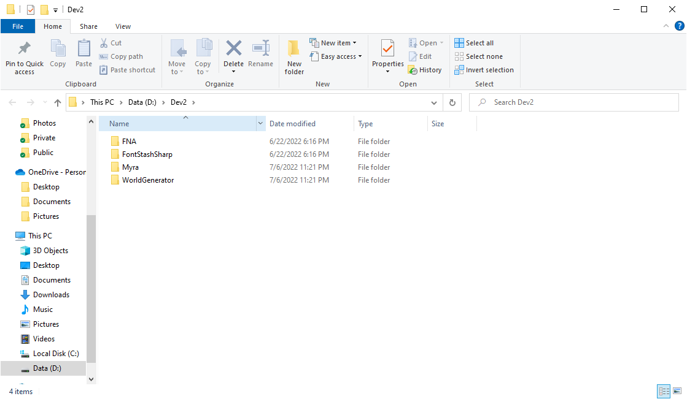

# WorldGenerator
FNA/MonoGame Port of https://github.com/jongallant/WorldGeneratorFinal

# Building from Source Code for MonoGame
Open WorldGenerator.MonoGame.sln in the IDE.

# Building from Source Code for FNA
1. Clone following libraries:

   a. [FNA](https://github.com/FNA-XNA/FNA)
   
   b. [FontStashSharp](https://github.com/FontStashSharp/FontStashSharp)
   
   c. [Myra](https://github.com/rds1983/Myra)
     
   The overall project structure is expected to be following: 

2. Open WorldGenerator.FNA.Core.sln in the IDE.
3. After succesful build, copy [FNA Native Binaries](https://fna.flibitijibibo.com/archive/fnalibs.tar.bz2) to the output binary folder.

## Sponsor
https://www.patreon.com/rds1983

https://boosty.to/rds1983

bitcoin: 3GeKFcv8X1cn8WqH1mr8i7jgPBkQjQuyN1

# Screenshots

# Credits
* [WorldGeneratorFinal](https://github.com/jongallant/WorldGeneratorFinal)
* [AccidentalNoiseLibrary](https://github.com/TinkerWorX/AccidentalNoiseLibrary)
* [FNA](https://github.com/FNA-XNA/FNA)
* [MonoGame](https://www.monogame.net/)
